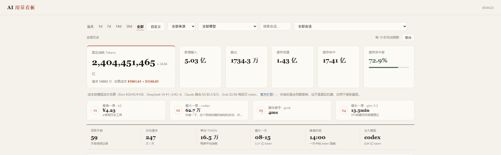
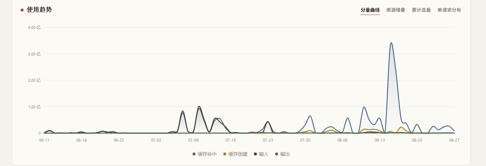
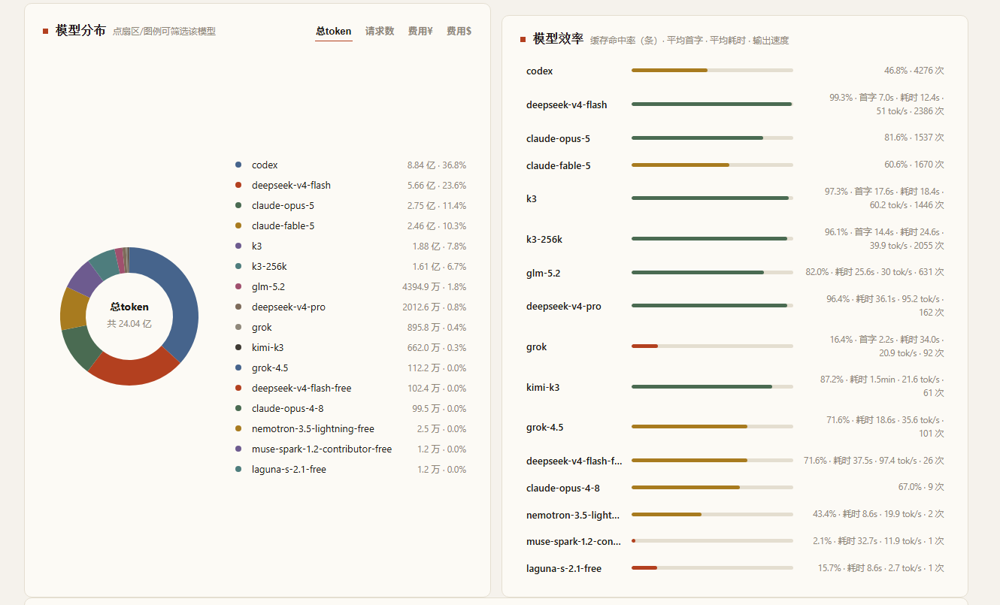
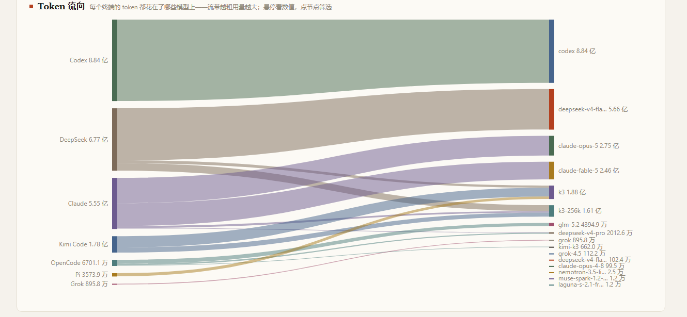

# AI 用量看板（TokenScope）

本机 AI 编程终端的用量观测面板：自动扫描本机多个 AI 编程工具的会话日志，
汇总 token 用量、缓存命中率、成本估算、首字延迟与耗时，打开一个网页全部看清。

**零外部依赖**：后端纯 Python 标准库，前端单 HTML 文件（原生 JS + 手绘 SVG 图表），
Windows 下双击即启动。

## 界面预览



统计总览：真实消耗、缓存命中率、分币种估算成本、高光时刻与统计速览墙。



使用趋势：分量曲线 / 来源堆叠 / 累计总量 / 单请求分布四种视图。



模型分布环图 + 模型效率榜（命中率、首字、耗时、输出速度）。



Token 流向桑基图：每个终端的 token 花在了哪些模型上。

## 功能一览

- **统计总览**：真实消耗 token、新增输入、输出、缓存创建/命中、缓存命中率、
  请求数、分币种估算成本，并带环比（与上一周期对比）
- **使用趋势**：四种视图——分量曲线 / 来源堆叠 / 累计总量 / 单请求分布散点
  （每个气泡是一次请求，大小=输出量，纵轴自适应线性/对数）；时间范围
  当天 / 1d / 7d / 14d / 30d / 全部 / 自定义（精确到分钟），可按来源、模型、会话筛选
- **Token 流向桑基图**：终端 → 模型的流量分布，流带宽度即 token 量，点击可筛选
- **模型分布环图 + 模型效率榜**：按模型聚合命中率、平均首字、平均耗时、输出速度（tok/s）
- **使用节律热力图**：星期 × 小时的 token/请求强度矩阵，一眼看出 coding 作息
- **高光时刻**：最贵一单 / token 最大一单 / 首字最快 / 耗时最长，点击直达会话
- **统计速览墙**：活跃天数、最忙的一天、峰值小时等报刊式速览
- **会话排行**：按烧钱排序的会话列表，标题取各终端自己的命名（Kimi 自定义标题、
  Codex 线程名、OpenCode/DeepSeek Harness 标题事件等），标题下附所在目录，点击筛选
- **请求明细**：每次模型调用一行——时间、会话、来源、模型、TTFT、耗时、
  提示/命中/创建/补全 token、总 token、命中率、费用、结束原因；
  五列排序、行内展开、CSV 导出
- **体验**：深色模式、10 秒自动刷新、千分位/中文计数（万/亿）格式化、
  `?range=all&source=` URL 参数预设筛选（可分享链接）

## 快速开始

```bash
pythonw server.py          # 或双击 打开面板.bat
```

浏览器自动打开 `http://127.0.0.1:8765`；已在运行则复用现有实例。
只监听本地回环，数据不出本机。

## 数据来源

| 来源 | 数据位置 | 首字/耗时 | 成本 |
|---|---|---|---|
| Kimi Code | `~/.kimi-code/sessions/` wire.jsonl | ✅ | [官方价](https://www.kimi.com/zh-cn/help/kimi-api/api-pricing)估算（¥） |
| Claude | `~/.claude/projects/` | ❌（日志无记录） | 路由价估算（$） |
| Codex | `~/.codex/sessions/` | ❌ | —（费率不明不估算） |
| Pi | `~/.pi/agent/sessions/` | ❌ | 日志自带（$）优先，缺失按价目估算 |
| Grok | `~/.grok/logs/unified.jsonl` | ✅ | — |
| OpenCode | `~/.local/share/opencode/opencode.db`（SQLite，stdlib `sqlite3` 直读） | 仅耗时 | 日志自带（$） |
| DeepSeek Harness | `~/.dsh/sessions/`（zstd 帧，借 node 解码，见 `dsh_decode.js`） | ✅ | 按 Kimi 官方价估算（¥） |

说明：

- 首字延迟只有 Kimi Code / Grok / DeepSeek Harness 的日志能拿到，其他来源显示 `-` 是数据本身没有
- 成本均为**按公开价的等效估算，不是真实扣费**（会员额度制尤其如此），仅用于感受量级；
  日志自带 cost 的来源（Pi / OpenCode）优先采用日志值
- 自定义费率：复制 `tokenscope.config.example.json` 为 `tokenscope.config.json` 修改——
  `prices` 按来源兜底，`modelPrices` 按模型定价（**优先于来源价**，同一路由跑多家模型时必须用模型价）

## 架构与实现

```
打开面板.bat ──► server.py（http.server，API + 静态托管）
                     ├─ tokenscope.py   核心库：扫描/解析 Kimi 日志，产出统一请求记录
                     └─ sources.py      其余六个终端的日志适配器（统一记录格式）
                            └─ dsh_decode.js  node 子进程解码 zstd 帧（CREATE_NO_WINDOW）
                     ▼
                panel.html  前端单页：每次请求现读磁盘，改完刷新即生效
```

设计取舍：

- **不落地数据库**：API 每次现扫日志 + 按文件签名（mtime/size）缓存解析结果，
  日志增量变化只重扫变化的文件
- **定价模型级优先、来源兜底**：日志里的模型名经常与来源不一致（路由器场景），
  估算成本时先查模型价再退回来源价；费率不明的来源宁可不算也不瞎编
- **前端零构建**：一个 HTML 文件，SVG 图表手写，换主题走 CSS 变量

## API

`/api/overview`（含环比 prev / 极值 highlights / stats）· `/api/trend`（bySource、
requests、costCur）· `/api/requests`（排序、CSV、`all=1` 导出）· `/api/sessions` ·
`/api/models` · `/api/heatmap` · `/api/meta`

## 环境

Windows 10/11 + Python 3.10+；仅 DeepSeek Harness 来源需要本机有 node（解码 zstd）。
